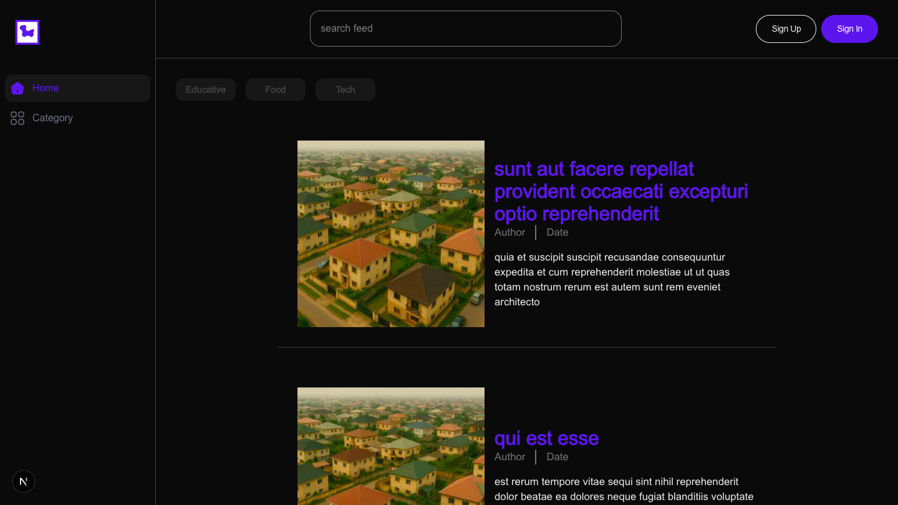
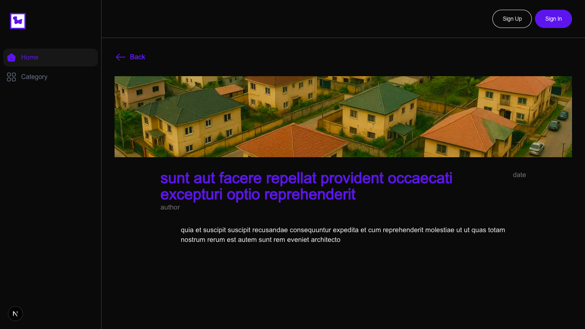

A simple dynamic content feed application built with **Next.js**, **TailwindCSS** and **React Query**. 
---

## 🚀 Live Demo

**🔗 [Live Site (Deployed on Vercel)](https://social-media-thatchidinmas-projects.vercel.app/)**


## 📸 Screenshots

| Feed Page (Desktop)                       | Detail Page                                   |
| ----------------------------------------- | --------------------------------------------- |
|  |  |

---

## 📦 Tech Stack

* **Next.js** (App Router)
* **React 18+**
* **TypeScript**
* **React Query (TanStack)** – for data fetching, caching
* **Tailwind CSS** – responsive UI styling
* **React Intersection Observer** – infinite scrolling
* **Mock API (JSONPlaceholder + Manual Filtering)**
* **Jest + Testing Library** – unit & integration tests

---

## 🧹 Features

### ✅ Core Functionality

* **Feed Page**

  * Paginated feed with infinite scroll
  * Display: Title, description snippet, author, date, thumbnail
* **Detail Page**

  * Dynamic route `/[slug]`
  * Detailed post content with SEO metadata
* **Search & Filter**

  * Filter posts by category (manually tagged)
  * Search by title/description
  * Preserves filters in URL

---

### 🧠 Technical Details

#### 🌐 Routing & SEO

* SEO meta tags per page (title, description)
* Dynamic routing using `app/` directory

#### ♻️ State Management

* React Query for fetching & caching
* Infinite scroll with proper loading & error states

#### 📱 Responsive UI

* Sidebar layout for desktop
* NavBar only for mobile
<!-- * Theme toggle: Light/Dark Mode -->

<!-- #### 🧪 Testing

* Unit tests for:

  * FeedCard
  * SearchBar
* Integration test:

  * Search & filter interaction flow

--- -->

## 🛠️ Installation & Setup Instructions

Follow these steps to run the project locally on your machine:

### 1. **Clone the Repository**

```bash
git clone https://github.com/Thatchidinma/social-media.git
cd social-media
```

### 2. **Install Dependencies**

Ensure you have **Node.js (v16+)** and **npm** or **yarn** installed.

```bash
# Using npm
npm install

# Or using yarn
yarn install
```


### 3. **Run the Development Server**

```bash
npm run dev
```

Then open your browser at:

**[http://localhost:3000](http://localhost:3000)**

### 5. **Build for Production**

```bash
npm run build
npm start
```

### 6. **Run Tests**

```bash
# Run unit and integration tests
npm run test

# Watch mode
npm run test:watch
```

### 7. **Deploy the App**

Deploy easily using **Vercel**:

connect your GitHub repository to [vercel.com](https://vercel.com/) for CI/CD deployment.

---

## 🛠️ Mock API Strategy

* **JSONPlaceholder** used for base data
* Simulated categories by assigning them manually in UI

---

## ✨ Bonus Features

* ✅ Dark/Light mode toggle
* ✅ Responsive sidebar for large screens
* ✅ URL params handling for filters & pagination
<!-- * ✅ Transition animations (Framer Motion) -->
* ✅ Deployed to **Vercel**
